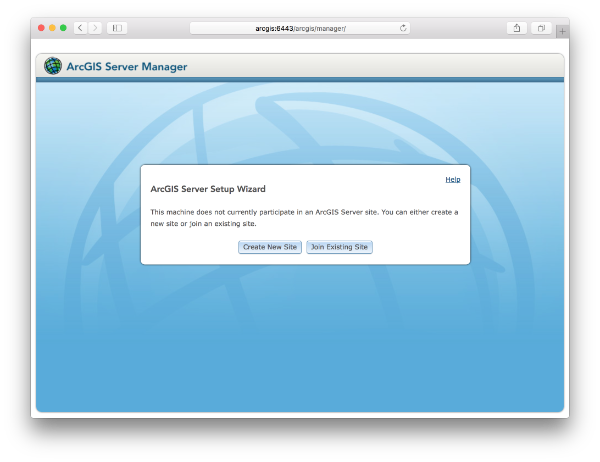

# ArcGIS For Server On Docker

The following steps will bootstrap a Linux flavored [ArcGIS for Server](http://www.esri.com/software/arcgis/arcgisserver) in a [docker](https://www.docker.com/) container.

## Start A Machine

The following will start a local [docker machine](https://docs.docker.com/machine/get-started/) in [VirtualBox](https://docs.docker.com/machine/drivers/virtualbox/) named `arcgis` with `8GB` of Memory, `4` CPUs and with `32GB` of disk space.

```bash
docker-machine create\
 --driver virtualbox\
 --virtualbox-memory 8192\
 --virtualbox-cpu-count 4\
 --virtualbox-disk-size 32768\
 --virtualbox-no-vtx-check\
 arcgis
```

For convenience, update your `/etc/hosts` file so you can access the container by its hostname `arcgis`.

```bash
echo "$(docker-machine ip arcgis) arcgis" >> /etc/hosts
```

Setup the environment in such that the `docker` cli communicates with the created machine.

```bash
eval $(docker-machine env arcgis)
```

## ArcGIS Resources

Download ArcGIS for Server `ArcGIS_for_Server_Linux_104_XXXX.tar.gz` from [my.esri.com](https://my.esri.com/#/downloads) and download your license file `XXXX.prvc` from the [provisioning](https://my.esri.com/#/provisioning/417547) section.

## Building The Image

```bash
docker build\
 --force-rm=true\
 --ulimit nofile=65535:65535\
 --ulimit nproc=25059:25059\
 -t mraad/arcgis .
```

Clean dangling images using:

```bash
docker rmi -f $(docker images -q -f dangling=true)
```

## Running The Image

```bash
docker run\
 -it --rm\
 --hostname arcgis\
 --memory-swappiness=0\
 -p 6080:6080\
 -p 6443:6443\
 mraad/arcgis
```

## Create A New Site

Navigate to <http://arcgis:6080/arcgis/manager>:


